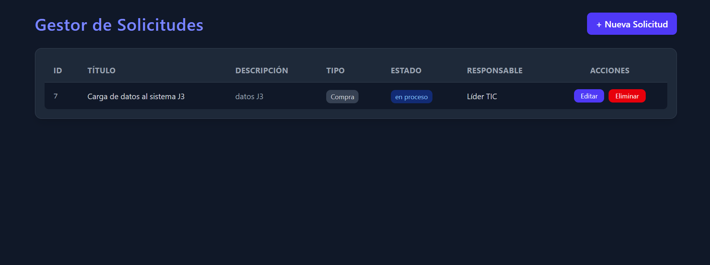
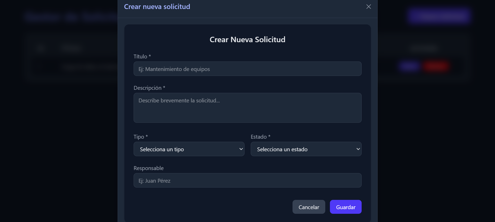

# 🧰 ServiSystem - Gestor de Solicitudes

## 🚀 Descripción General
**ServiSystem** es una aplicación web fullstack que permite gestionar solicitudes internas de servicios o soporte técnico dentro de una organización.  
Fue desarrollada con el stack **React + TailwindCSS + Node.js + Express + MySQL**, aplicando arquitectura modular, buenas prácticas y un diseño oscuro profesional.

---

## 🧩 Características Principales
- CRUD completo (crear, leer, actualizar, eliminar) de solicitudes.
- Notificaciones dinámicas mediante **React Toastify**.
- Diseño **dark mode**, moderno y responsive.
- Estructura de backend modular (rutas, controladores y conexión a base de datos).
- Conexión directa a **MySQL** con consultas parametrizadas.
- Separación limpia entre frontend y backend.

---

## 🛠️ Tecnologías Utilizadas
**Frontend:**
- React + Vite
- TailwindCSS
- Axios
- React Toastify

**Backend:**
- Node.js
- Express.js
- MySQL (conector mysql2)

**Base de Datos:**
- MySQL (local con XAMPP o remoto)

---

## ⚙️ Instalación y Configuración

### 1️⃣ Clonar el repositorio
```bash
git clone https://github.com/tuusuario/servisystem.git
cd servisystem
```

### 2️⃣ Configurar la base de datos
Importa el script SQL ubicado en `/database/servisystem_db.sql` en tu servidor local (XAMPP o MySQL Workbench).

### 3️⃣ Configurar variables del backend
Dentro de `/backend/.env` crea el siguiente archivo:
```env
PORT=4000
DB_HOST=localhost
DB_USER=root
DB_PASSWORD=
DB_NAME=servisystem_db
```

### 4️⃣ Instalar dependencias
#### Backend
```bash
cd backend
npm install
```
#### Frontend
```bash
cd ../frontend
npm install
```

### 5️⃣ Ejecutar el proyecto
#### Iniciar backend:
```bash
cd backend
npm start
```
#### Iniciar frontend:
```bash
cd ../frontend
npm run dev
```

El sistema estará disponible en:
- Frontend → http://localhost:5173
- Backend → http://localhost:4000/api

---

## 🧠 Endpoints principales

| Método | Endpoint | Descripción |
|--------|-----------|--------------|
| GET | `/api/solicitudes` | Obtiene todas las solicitudes |
| GET | `/api/solicitudes/:id` | Obtiene una solicitud específica |
| POST | `/api/solicitudes` | Crea una nueva solicitud |
| PUT | `/api/solicitudes/:id` | Actualiza una solicitud existente |
| DELETE | `/api/solicitudes/:id` | Elimina una solicitud |

---

## 🖥️ Capturas de Interfaz
### Dashboard principal


### Formulario de solicitud


---

## 📂 Estructura del Proyecto
```
servisystem/
│
├── backend/
│   ├── server.js
│   ├── db.js
│   ├── routes/
│   │   └── solicitudesRoutes.js
│   └── controllers/
│       └── solicitudesController.js
│
├── frontend/
│   ├── src/
│   │   ├── api/
│   │   │   └── solicitudesApi.js
│   │   ├── components/
│   │   │   ├── SolicitudesTable.jsx
│   │   │   └── SolicitudForm.jsx
│   │   ├── pages/
│   │   │   └── Dashboard.jsx
│   │   └── main.jsx
│   └── index.html
│
└── database/
    └── servisystem_db.sql
```

---

## 💡 Próximas Mejoras
- Añadir **roles de usuario (admin / técnico)**.
- Implementar paginación y filtros avanzados.
- Deploy completo en **Vercel + Render**.

---

## 👨‍💻 Autor
**Fabian — Desarrollador FullStack (React | Node.js | SQL)**  
🌐 www.linkedin.com/in/yerson-rodriguez

---

© 2025 ServiSystem - Yerson Rodriguez. Todos los derechos reservados.